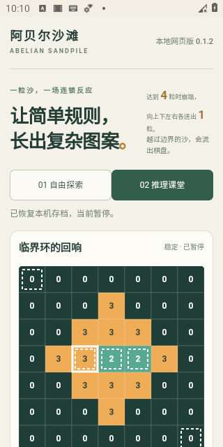

# v0.1.2 首个 APK 预发行核对报告

- 日期：2026-10-09（Asia/Shanghai）；本游戏包名com.xiaoxuhui.abeliansandpile。
- 当前阶段：v0.1.2预发行已公开，五个附件匿名回读及签名／身份／网页内容复核全部通过。
- 源码阶段：8cb35de规划；0294d38外壳与固定签名；c68a923构建；27a5eac纠正Canvas验收事件；f833d35加入旋转与发行说明。
- [候选构建及Android模拟器CI](https://github.com/xiaoxuhui/abelian-sandpile/actions/runs/37851239514)：build／emulator均completed/success；[工程CI](https://github.com/xiaoxuhui/abelian-sandpile/actions/runs/37851239517) completed/success。

## 工程与网页验收

Windows、Node24.19.0、Chrome154.0.8037.98。实跑node scripts/check.mjs检查31JS／11必需文档；node scripts/build.mjs生成13资源；node scripts/sync-android-assets.mjs及--check均13文件一致；node --test共53passed、0failed、0skipped；十关可达性／最少层证明通过。

构建前首次结构红测试因缺失android-assets.config.mjs出现1文件失败。实现后14外壳结构项＋原39项全部通过，不跳过缺失assets。CI Node22／24在测试前显式构建同步；结构测试确实执行，非仅文件存在。

真实Chrome B01–B16、R01–R08、T01–T08共32项通过，0页面／控制台／HTTP错误，涵盖十关Canvas通关、浏览器实际下载／导入、负例、存档、触摸、离线及子路径。N01–N04额外4项验证显式原生桥内容／暂停／取消／失败反馈，使用已明确声明的stub，只属于浏览器接口验收。总计36项浏览器验收，不能混称36项Android真机检查。

本机无可用JDK／SDK，不以本地编译作为证据；APK由固定AGP8.5.2／Gradle8.7／JDK17／compileSdk34云端编译，assembleDebug、assembleDebugAndroidTest和lintDebug均成功。

## Android 运行证据

Android11（API30）、x86_64／google_apis模拟器，实际WebView83.0.4103.106；关闭Wi-Fi及移动数据后安装并运行候选APK。JUnit **1个集成用例通过**（不拆分夸大数量），实际覆盖：固定HTTPS本地origin、真实JNI桥存在、十关载入、自由投沙、循环增加、后台停止、Activity重建存档保持且暂停、临界环六波／十四次、回放不改物理态、竖横屏旋转保持棋盘。

首次c68a923模拟器失败为预期6波实际null：验收脚本发送pointerdown，但项目Canvas实际监听click。27a5eac改为MouseEvent click，f833d35复验及旋转均通过；未删断言／skip／门禁。原失败日志保留于failures/c68a923-emulator.txt。本机没有同Android运行时，不声称完成本地同环境复现。

Android截图已查看：系统栏与页面分开，320px课堂棋盘／允许落点可读，恢复保持暂停。截图是冷开后恢复的棋盘，不是浏览器模拟截图。

## 候选静态身份、签名和内容

从当前候选artifact11581349333下载，ZIP摘要75bb0e14516549afcae412188df83f5f79eb9bdcc5d7728ef421d2a221d19382与API artifact digest一致。

| 项目 | 实际结果 |
| --- | --- |
| APK文件 | abelian-sandpile-android-0.1.2-debug.apk，2296876字节 |
| APK SHA256 | 823930ca2369ee0e8b4d15ab4a2f14e2d13a7ac29198a9ae697108f102631a49 |
| 二进制Manifest | package com.xiaoxuhui.abeliansandpile；versionName0.1.2；versionCode1 |
| 二进制SDK | min24／target34 |
| 权限 | 无系统权限；仅AndroidX自动合并的本应用DYNAMIC_RECEIVER_NOT_EXPORTED_PERMISSION，protectionLevel2（signature） |
| apksigner | Verifies；v2=true；1个签名者；不要求不存在的v1 CERT.RSA |
| v2证书 | 与仓库PKCS12导出的DER逐字节相等 |
| 证书subject | C=CN,O=xiaoxuhui,CN=Abelian Sandpile Debug |
| 证书SHA256 | e326c53f5843c42887cf6c5dac26b001cff3679245a8e51a0b288f2da3530d7a |
| notBefore | 2026-10-08T21:52:51+00:00 |
| notAfter | 2056-09-30T21:52:51+00:00 |
| APK网页 | 精确13文件，与本地最新dist逐字节相等，无额外开发脚本；Apache许可证及声明存在res/raw |
| 网页ZIP | 13运行文件＋asset-manifest.json，全部逐字节与dist相等 |
| 云端网页ZIP SHA256 | 4ad83edbef9388b6b84469181d314371ef70a40f2017054dab505541998ec4cb |

本机脚本独立提取二进制SDK／权限并比较云端网页ZIP；本机与CI使用不同Python/zlib时压缩ZIP字节可不同，因此最终分发云端经过核对的ZIP，不拿压缩摘要差异冒充内容差异。

## 开源发行审计

| 审计项 | 判定／证据 |
| --- | --- |
| 许可 | PASS：MIT抬头、2026/xiaoxuhui及package license相符；Android模板来源同作者MIT，AndroidX／Kotlin Apache全文随APK分发 |
| 清单 | PASS：name/version/repository/homepage/bugs/engines齐全；private:true为静态应用，不发npm；无npm安装依赖，无需锁文件 |
| CI | PASS：Node22／24实际检查、同步、53测试、十关证明、构建；Android编译／lint／运行通过；没有独立Web浏览器CI，已有本地36项证据 |
| 测试 | PASS：独立引擎、物理账本、穷举及真实操作，数字见上表 |
| CHANGELOG | 发行前将0.1.2带日期条目标为预发行，避免把未发布版本当正式稳定版 |
| 标签／Release | 本步骤授权已提供，执行及公开回读记录将在下节追加；完成前不标已发布 |
| README链接 | 原13本地链接已检查；新版安卓报告／发行说明存在，收尾再查全部链接 |
| 社区文件 | CONTRIBUTING／SECURITY存在，安全联系xixuui@qq.com；CODE_OF_CONDUCT／issue模板／dependabot缺失，作为polish，不冒充已有 |
| 卫生 | 工作分支起点干净；源码无TODO/FIXME，console.log仅开发工具；扫描无token／生产私钥。公开debug.keystore为技能及授权的有意例外，固定且无其它游戏密钥复用 |
| 网页专项 | 离线ZIP与file://支持；浏览器file／http／APK origin隔离通过JSON迁移；在线演示为可选，不是此发布的前置 |

准备项均在本仓库代办；用户已授权发布，标签与Release本次直接执行，不留用户自行运行命令的例行审批。

## 未测边界

真实手机／平板的安装、系统文件保存／导入体验、返回键及实际系统栏仍待用户反馈。自动化覆盖的是模拟器运行；Activity重建不能冒充杀进程复验。首包无前版，跨版本覆盖安装及保留存档待下版补验；本次已固定证书与首包versionCode基线。

未修改大厅，不创建第五游戏注册或原生大厅桥。此预发行不是v1.0稳定性审计。自动审批拒绝CI长期contents:write自动发布权限，因此CI仅构建验证，本次Release由现有用户授权的独立步骤发布。

完整证据在[evidence/android-v0.1.2](evidence/android-v0.1.2/)：engineering-tests.txt、levels.txt、browser.txt、repeat-browser.txt、teaching-browser.txt、bridge-browser.txt、instrumentation.txt、webview.txt、candidate-apk-verification.json、apksigner.txt、binary-sdk-and-web.txt。

## 正式预发行与匿名回读

发行标签v0.1.2的源提交为5f95b1ad31befea93328317e8a24a14406f8f3f8，main快进及远端tag解引用一致。对应[标签APK构建／模拟器CI](https://github.com/xiaoxuhui/abelian-sandpile/actions/runs/37852389593)与[标签工程CI](https://github.com/xiaoxuhui/abelian-sandpile/actions/runs/37852389558)均completed/success。采用标签运行的artifact，不以旧候选替代。

[GitHub Release v0.1.2](https://github.com/xiaoxuhui/abelian-sandpile/releases/tag/v0.1.2)（ID407309588）公开、draft=false、prerelease=true，发行说明与准备的Markdown完全相同。先创建草稿、逐项核对上传状态／大小，再公开；没有增加CI写权限。

| 最终附件 | 字节数／SHA256 |
| --- | --- |
| abelian-sandpile-android-0.1.2-debug.apk | 2296848；66f63b608454ef5a4a554b5e26a00e1e715d312b4bb134345ffa5496307f47c0 |
| abelian-sandpile-web-0.1.2.zip | 27979；4ad83edbef9388b6b84469181d314371ef70a40f2017054dab505541998ec4cb |
| SHA256SUMS.txt | 204；7bdc1cb6a3bc35333f1ee53aca8c5f5218770d3a6c94ef42dd9fafe7882c94f7 |
| apk-verification.json | 842；eb2f391937178b13defe12bc49af7cca1b8a44c3ce2e72e26a7f30df73853df8 |
| apksigner.txt | 966；7b21e416d7832a3c343dae650b283bd62b536e90ecf9bf10b504505d73b3f004 |

**上表为最终分发包摘要**，与前文第一次候选摘要分开保留。五份文件均不携带认证从公开URL下载，其摘要同时等于标签artifact、本地release文件、GitHub asset digest。匿名APK再次提取二进制Manifest及SDK／权限、v2证书DER并比较13份网页；匿名ZIP再逐字节比较13资源及manifest，全过。标签artifact ZIP摘要ad1a3ad628600a5f0193ca6df50dca2077fcb7bae5ef34e48338e9205545f765。

证据：published-release.json、tag-artifact.json、tag-apk-verification.json、anonymous-download.json、anonymous-apk-verification.json、anonymous-sdk-and-web.txt、published-SHA256SUMS.txt。发布后的文档归档提交不移动发行标签；用户APK始终追溯到上述源码和CI。

标签／Release审计项现为PASS；无剩余本次预发行阻断项。真机和跨版本验收仍是上节明确的待验项，未冒充自动化已覆盖。

发行证据在4bc238c归档COMPLETE后，实跑check31JS／11文档、53Node全部通过、14 README本地链接存在及diff检查；4bc238c2db118856d6298012637f7ad577f2224b与远端main一致、工作树干净，再将计划归档VERIFIED。发行标签保持5f95b1a不变，后续文档提交不改变已经分发的APK。
