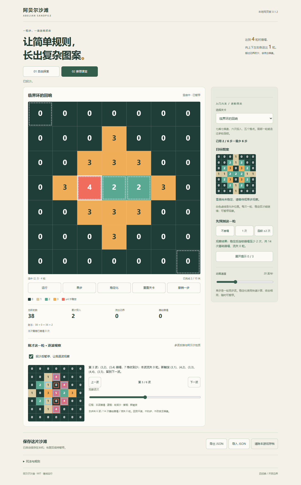
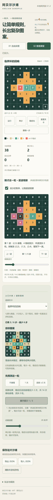

# v0.1.2 推理课堂测试报告

- 日期：2026-10-09（Asia/Shanghai）。范围：阿贝尔沙滩单游戏本地网页。
- 规划提交：8879af9；领域／关卡提交：e773f1d；界面／浏览器证据提交：2035e15。
- 结论：39 项 Node 测试、十关可达性／最少步数证明、32 项真实 Chrome 操作全部通过；无页面／控制台错误或 HTTP 失败。
- 本版依据用户“教学观察太普通”推进。方向询问未收到回复，采用兼容原玩法的推理＋解释结合：预测可选、提示主动展开、主棋盘与观察副本分离。

## 实际交付与兼容

入门六关保留；追加桥上的临界点、十字路口、海岸的代价、临界环的回响。新关有多个允许落点，已证最少步数 4／5／5／6。课堂提供三种可选预测、结果反馈、投后暂停、逐波前后／滑块回放、崩塌源／收到沙粒／下一波临界标记、流失说明及三层提示。

回放在动作前状态副本上计算，不扣步、不改主棋盘与存档。预测使用本动作基础崩塌次数，不把一波中多个崩塌格误算为单次；六波和十四次含义不同。最终提示给投入分配，不宣称某个先后顺序是唯一解。

规则仍为 square4-open-v1，存档仍为 abelian-sandpile-save-v1。实现前捕获的旧六关数据与实际旧包络保留于 tests/fixtures/v0.1.1-*.json；原物理数据、ID/version、进度与挑战历史均兼容。预测、提示、回放及观察勾选为临时页面状态，刷新不恢复。未稳定挑战仍按原合同回退至动作前稳定检查点。

## Node、数据与工程验证

环境：Windows、Node.js v24.19.0。以下均实际退出 0：

| 命令 | 实际结果 |
| --- | --- |
| node scripts/check.mjs | 27 JS／11 必需文档，计划 schema 有效 |
| node --test | 39 passed，0 failed，0 skipped |
| node --test tests/lesson.test.mjs tests/challenge.test.mjs tests/storage.test.mjs | 实现后首次专项 15／15 通过 |
| node scripts/sync-levels.mjs --check | 10 条正式／浏览器数据一致 |
| node scripts/verify-levels.mjs | 10 levels verified; 0 failures |
| node scripts/build.mjs | 13 份运行资源，v0.1.2 playable |
| git diff --check | 无空白错误 |

新增测试先红后绿：首次执行 node --test tests/lesson.test.mjs 因 lesson.js 尚不存在出现 **1 个测试文件失败**，并非五个用例均已执行失败。实现后五组轨迹用例通过：不可变输入、每个合法初始落点及完整参考路径与独立参考一致、预测分类、旧数据及旧存档兼容、进阶选择与预算证明。其它 34 项引擎、存档、挑战、取消、循环和工程用例继续全过。

十关最少层：1／1／1／1／2／2／4／5／5／6；visited：2／2／2／2／10／10／70／252／126／462。最优性依据逐层 BFS 首次目标层，完整结果见[关卡验证报告](关卡验证报告.md)。S06/S07 验证构建摘要、精确资源清单及两次构建字节一致。

## 真实浏览器验证

Chrome 154.0.8037.98，Playwright 驱动真实 DOM／Canvas，headless；桌面 1280×1000（课堂）及 1280×900（原流程），手机 320×740、DPR 2、模拟触摸。三个脚本均使用本游戏 4180 本地服务及已构建 file:// 产物：

```powershell
$env:PLAYWRIGHT_MODULE='D:\soft\conway-life-game\node_modules\playwright'
$env:PREVIEW_URL='http://127.0.0.1:4180'
node scripts/verify-teaching-browser.mjs
node scripts/verify-browser.mjs
node scripts/verify-repeat-browser.mjs
```

这里只读取现有浏览器测试工具，不修改该游戏仓库。没有网络 API 或运行时第三方依赖进入产物。

| 验收 | 实际覆盖 | 结果 |
| --- | --- | --- |
| T01 | 两分组十关；不预测也能正常通关 | PASS |
| T02 | 错误预测反馈、投后实际暂停、原始主盘保持；前后及键盘滑块回放只读 | PASS |
| T03 | 撤销／重置／换关清掉旧观察；正确预测反馈 | PASS |
| T04 | 三层主动提示；第三层才给投入分配，展开完禁用按钮 | PASS |
| T05 | 临界环第二次左侧投入显示六波／十四次；选择第三波不改实际状态 | PASS |
| T06 | 旧 save-v1 fixture 导入完全相同，刷新进度保持、课堂临时状态清空 | PASS |
| T07 | 320px 真实模拟触摸回放／提示、旋转、无横溢出、主盘不变 | PASS |
| T08 | 大厅形状子路径和完全离线 file:// 课堂资源可用 | PASS |
| B01–B06 | 旧探索、键盘、数值负例、取消确认、预设／队列、大盘中止及旧帧隔离 | 6／6 |
| B07–B08 | 十关 Canvas 实际通关；禁区、末步失败、撤销、历史最好 | 2／2 |
| B09–B13 | 保存刷新、实际下载／导入、清空哨兵、损坏／未来／大文件负例及配额异常 | 5／5 |
| B14–B16 | 触摸耗散、旋转／大字／长计数、子路径、离线通关与导出 | 3／3 |
| R01–R08 | 循环启停、键盘／触摸、旧帧、模式取消、导入／刷新／隐藏、预算和离线 | 8／8 |

课堂 8／8＋原流程 16／16＋循环 8／8＝**32／32**。完整输出：[课堂](evidence/v0.1.2/teaching-browser.txt)、[原流程](evidence/v0.1.2/browser.txt)、[循环](evidence/v0.1.2/repeat-browser.txt)。

截图已实际查看：桌面能区分暂停主盘与第三波观察副本；手机格子数字、标记、提示和按钮可读。





## 边界与后续

未生成 APK、标签或 Release；未改大厅或其它游戏。移动触摸为浏览器模拟，Android 真机／WebView／原生桥和大厅宿主验收未执行；该边界与用户的网页优先安排一致。

本版波次观察仅用于小型正式课堂棋盘，最多 256 波，生成超限只报告无法解释，不回滚已合法受理的实际投入。不声称完成自定义关卡导入、任意大盘轨迹或全部 v0.3 规划。

## 提交及远端核对

领域、界面、文档各切片均立即推送。报告归档 e7611c10c0603d9bda03b6fc77b7db983ec41a03 与 git ls-remote --heads origin main 完全一致；归档后工作树干净，再次 check、39 项测试、同步、十关证明和13文件构建全部通过，实施计划从 COMPLETE 更新 VERIFIED。

[实现提交 CI](https://github.com/xiaoxuhui/abelian-sandpile/actions/runs/37807973085) Node 22／24 两项 completed/success；[文档归档 CI](https://github.com/xiaoxuhui/abelian-sandpile/actions/runs/37808338579) completed/success。这是本游戏源码与网页验证，不是 APK／宿主验收证据。
